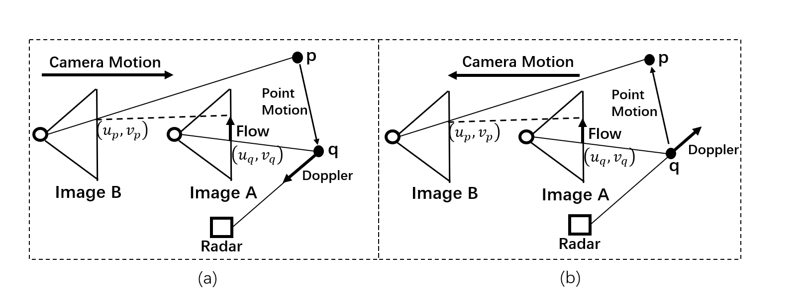

# Full-Velocity Radar Returns by Radar-Camera Fusion


**The radar full velocity is estimated by using Doppler velocity and optical flow, which can be computed with (a) a previous image or (b) the next image.**


## Directories
```plain
data/ 	 
	nuscenes/                 		    
		annotations/
		maps/
		samples/
		sweeps/
		v1.0-trainval/
lib/
scripts/
external/       
	RAFT/                   	     				
```


## Setup
- Create a conda environment called pda
```bash
conda create -n pda python=3.6
```
- Install required packages
```bash
pip install -r requirements.txt
```
- Download [nuScenes dataset](https://www.nuscenes.org/) (Full dataset (v1.0) Trainval) into data/nuscenes/
- Clone external repos [RAFT](https://github.com/princeton-vl/RAFT) into external/

## Code
**1. Data preparation**

```bash
cd scripts

# 1) split data
python split_data.py

# 2) extract images for flow computation
python prepare_flow_im.py

# 3) compute image flow
python cal_flow.py 

# 4) transform image flow to normalized expression (u2,v2)
python cal_im_flow2uv.py  

# 5) create .h5 dataset file
python gen_h5_file3.py           
```

**2. Estimate radar-camera association**
```bash
python train_association.py        # train
python test_association.py         # demo
```
Download [pre-trained weights](https://drive.google.com/drive/folders/1Yz9_mtq5QqLlyAAhVoeJTaq0BiQdJMpA?usp=sharing)

**3. Predict radar full velocity**

```bash

# 1) generate offsets of radar projections based on associations
python test_association.py  --gen_offset

# 2) demo of full velocity prediction
python prd_full_v.py

# 3) evaluation of point-wise velocity
python pt_wise_error.py
```


## Citation
```plain
@InProceedings{Long_2021_ICCV,
    author    = {Long, Yunfei and Morris, Daniel and Liu, Xiaoming and Castro, Marcos and Chakravarty, Punarjay and Narayanan, Praveen},
    title     = {Full-Velocity Radar Returns by Radar-Camera Fusion},
    booktitle = {Proceedings of the IEEE/CVF International Conference on Computer Vision},
    month     = {October},
    year      = {2021}
}
```

